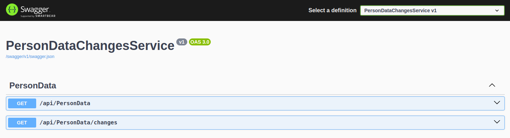

## Swagger UI 

go to http://localhost:5214/swagger



Two APIs will shown

- /api/PersonData for getting a list of dummy data
- /api/PersonData/changes for getting records based on start and end date

## Database schema for the Person entity is provided below

```c#
public class Person
{
    public string PersonalCode { get; set; }
    public string FirstName { get; set; }
    public string LastName { get; set; }
    public DateTime DateOfBirth { get; set; }
    public DateTime? DateOfDeath { get; set; } 
}
```

## Running on docker

**Please make sure that docker is installed**

```bash
docker run .
```

